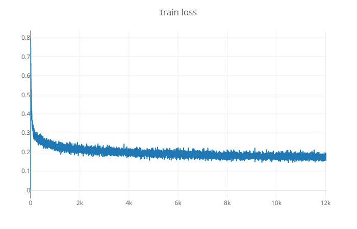
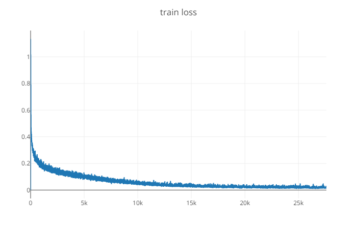
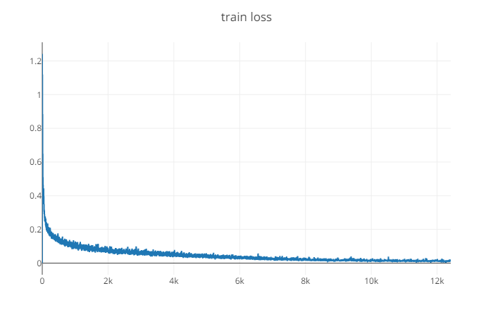
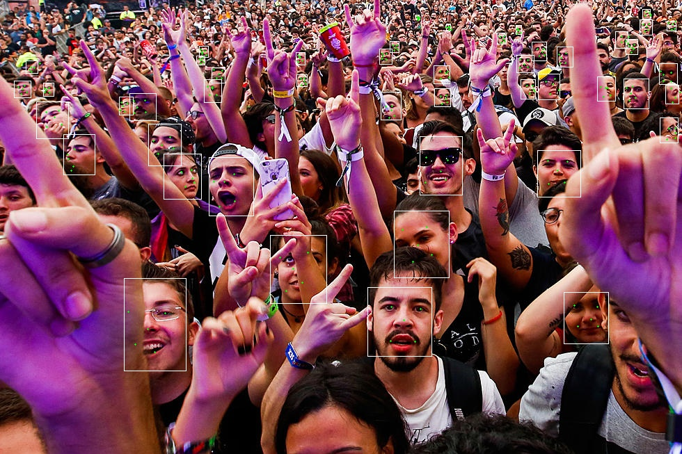

## 开始训练

有了上面的理论，那么我们开始怎么训练。

主要是处理数据，和模型参数选择调试，弄了一个星期（主要是因为菜）。这里主要介绍怎么运行我写的渣渣代码，和一些技巧

#### 先决条件

1. 您需要与CUDA兼容的GPU来训练模型。
2. 你应该先下载[WIDER Face](http://mmlab.ie.cuhk.edu.hk/projects/WIDERFace/)和[Celeba](http://mmlab.ie.cuhk.edu.hk/projects/CelebA.html)。**WIDER面部**用于面部检测，**Celeba**用于地标检测（这是原始纸张所必需的。但我发现Celeba中有些标签是错误的。tf_mtcnn使用[此数据集](http://mmlab.ie.cuhk.edu.hk/archive/CNN_FacePoint.htm)进行地标检测,但是我没有使用 --因为懒）

#### 准备培训数据及训练

- 下载相关数据到data/src/文件夹下，下面已经存在保存相应图片的路径

------

- 运行 gen_pnet_data.py 生成训练 pnet 的数据
- 运行 gen_landmark_data.py 12 生成训练 pnet 的landmark数据
- 运行 train.py  pnet  生成pnet 的模型

------

- 运行 gen_rnet_data.py 生成训练 onet 的数据
- 运行 gen_landmark_data.py 24 生成训练 rnet 的landmark数据
- 运行 train.py  rnet  生成rnet 的模型

------

- 运行 gen_onet_data.py 生成训练 onet 的数据
- 运行 gen_landmark_data.py 48 生成训练 onet 的landmark数据
- 运行 train.py  onet  生成onet 的模型

------

- 运行 detecter.py  进行测试，测试的图片数据存放在 / data/images 下

------

#### 细节

- 代码中没有使用原论文模型中生成 人脸的概率[batch,2]，而是使用单一输出[batch,1]
- 没有使用在线困难样本挖掘
- 对于**PNet**和**RNet来说**，保持高召回率是很重要的。所以在训练 pnet 的时候使用 比例(2,1,1,2)

#### 结果

#### 改进

- 数据的加载，及生成中样本的不平衡问题
- 加入在线困难样本挖掘
- 加快检测速度，主要是图像金字塔，和nms的改进
- 加入FDDB 的测试代码
- 加入人脸跟踪
- 由于数据的缺少和很多不正确导致特征定位不准

#### 参考

- 参考的太多了，所以不一一例举